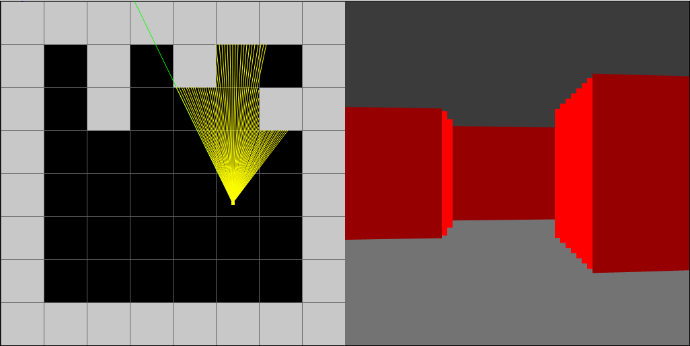

# wolfenstein

A Wolfenstein 3D-style raycaster written in vanilla JavaScript on an HTML canvas, with no engine and no runtime dependencies.



The left half is a top-down view of the 8×8 grid map, showing the player and the rays cast across a 64° field of view. The right half is the 3D view built from those rays: one vertical wall slice per ray.

## How it works

- For each ray, the caster steps across the grid one cell boundary at a time. It checks horizontal and vertical grid lines separately and keeps whichever wall hit is closer.
- It multiplies the hit distance by `cos(playerAngle - rayAngle)` to remove fisheye distortion. Wall height is inversely proportional to that distance.
- Walls hit on a vertical grid line are drawn in a brighter shade than walls hit on a horizontal one, which gives simple flat shading.
- When the player moves into a wall, they slide along it instead of stopping dead.

All of this is in `index.js`. `synthwave/` is a separate perspective-grid experiment, and `index-doom.js` is an older unfinished sketch.

## Controls

| Key       | Action        |
| --------- | ------------- |
| W / S     | Move forward / back |
| A / D, Q / E | Turn left / right |

## Running locally

Requires Node.js 20.19 or newer.

```bash
npm install
npm run dev
```

| Script            | What it does                                      |
| ----------------- | ------------------------------------------------- |
| `npm run dev`     | Start the Vite dev server                         |
| `npm run build`   | Build the static site, including the synthwave page, into `dist/` |
| `npm run preview` | Serve the production build                        |
| `npm run lint`    | ESLint                                            |

## Credits

The raycasting approach is based on Fabien Sanglard's [*Game Engine Black Book: Wolfenstein 3D*](https://fabiensanglard.net/gebbwolf3d/), which explains how the original 1992 engine works.
